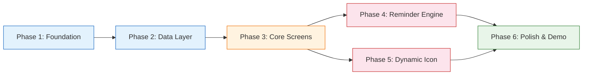

# Implementation Plan: The Forgetful Wishlister MVP

> Derived from [architecture.md](file:///c:/Users/tanis/projects/Myntra%20MVP/docs/architecture.md) · Targets the **Revisit** stage of the wishlist → purchase funnel

---

## Phase Dependency Graph



> **Phases 4 and 5 are independent** — they can be built in parallel once Phase 3 is complete. Phase 6 depends on both.

---

## Phase 1: Foundation & Scaffolding

> Set up the project, build tool, design system, routing, and app shell — everything the screens will mount into.

### Files to Create

| File | Purpose |
|---|---|
| `package.json` | Project metadata, Vite dependency |
| `vite.config.js` | Dev server config |
| `index.html` | App shell: viewport meta, font imports (Inter from Google Fonts), `<div id="app">`, script entry |
| `style.css` | Full design system: CSS custom properties (all tokens from architecture §9), reset, typography, layout utilities, animation keyframes |
| `src/app.js` | App entry point: initializes store, mounts router, renders initial screen |
| `src/router.js` | Hash-based SPA router: listens to `hashchange`, maps routes to screen render functions |

### What to Build

1. **Initialize Vite project**
   ```
   npm init -y
   npm install vite --save-dev
   ```
   Add `"dev": "vite"` and `"build": "vite build"` to `package.json` scripts.

2. **`index.html`** — mobile-first viewport, Google Fonts link for Inter, `<div id="app">` mount point, script tag pointing to `src/app.js` (type="module").

3. **`style.css`** — implement all design tokens from architecture §9 as CSS custom properties on `:root`. Include:
   - CSS reset (box-sizing, margin/padding zeroes)
   - Base typography (`font-family: var(--font-family)`)
   - Mobile-first container (max-width: 430px, centered, min-height: 100vh)
   - Animation keyframes: `pulse-warm`, `pulse-urgent`, `glow`
   - Utility classes for spacing, text sizes, flex layouts

4. **`src/router.js`** — simple hash router:
   - Routes: `#/` (home), `#/wishlist`, `#/product/:id`, `#/bag`
   - Exports `navigateTo(hash)` and `onRouteChange(callback)`
   - Parses route params (product ID)

5. **`src/app.js`** — imports router and store, calls `router.onRouteChange()` to mount the correct screen into `#app`, renders bottom nav persistently.

### Acceptance Criteria
- [ ] `npm run dev` starts Vite dev server without errors
- [ ] Blank app shell renders with correct fonts and Myntra pink accent visible
- [ ] Navigating between `#/`, `#/wishlist`, `#/product/1`, `#/bag` swaps content area
- [ ] Bottom nav bar renders (placeholder icons, no logic yet)

---

## Phase 2: Data Layer & State Management

> Build the store, seed product data, and implement localStorage persistence — the backbone everything reads from and writes to.

### Files to Create

| File | Purpose |
|---|---|
| `src/store.js` | Central state: products, wishlist items, bag items, nudge history, simulated clock. Syncs to localStorage on every mutation. |
| `src/data/products.json` | Seed catalog of 10–15 fashion products with realistic names, brands, prices, ratings, images |

### What to Build

1. **`src/data/products.json`** — 10–15 products across categories (dresses, shoes, bags, tops, accessories). Each product:
   ```json
   {
     "id": "p1",
     "name": "Floral Wrap Dress",
     "brand": "MANGO",
     "price": 2499,
     "originalPrice": 3999,
     "image": "/assets/products/dress-1.jpg",
     "category": "Dresses",
     "rating": 4.3,
     "reviewCount": 847,
     "viewerCount": 23
   }
   ```
   Use placeholder image URLs initially (will generate actual images in Phase 6).

2. **`src/store.js`** — reactive store with these responsibilities:
   - **State shape:**
     ```js
     {
       products: [],              // loaded from products.json
       wishlistItems: [],         // WishlistItem objects
       bagItems: [],              // items moved to bag
       nudgeHistory: [],          // WishlistNudge records
       simulatedTime: Date.now(), // for time simulation
       listeners: []              // subscriber callbacks
     }
     ```
   - **Methods:**
     - `addToWishlist(productId)` — creates WishlistItem with `addedAt: simulatedNow()`
     - `removeFromWishlist(itemId)` — sets status to "removed"
     - `moveToBag(itemId)` — sets status to "in_bag", adds to bagItems
     - `removeFromBag(itemId)` — removes from bagItems
     - `markItemViewed(itemId)` — updates `lastViewedAt`
     - `getActiveWishlistItems()` — returns items where status === "active"
     - `getItemAge(item)` — returns days between `simulatedNow()` and `item.addedAt`
     - `advanceTime(days)` — shifts `simulatedTime` forward
     - `resetTime()` — resets to `Date.now()`
     - `simulatedNow()` — returns current simulated timestamp
     - `subscribe(callback)` — registers a listener, called on every state change
     - `persist()` / `hydrate()` — save to / load from localStorage
   - **Persistence:** call `persist()` after every mutation; call `hydrate()` on app init

### Acceptance Criteria
- [ ] Products load from JSON and are accessible via `store.products`
- [ ] Adding/removing wishlist items updates state and survives page refresh
- [ ] `advanceTime(7)` shifts simulated clock by 7 days; `getItemAge()` reflects the shift
- [ ] `subscribe()` callback fires on every state mutation

---

## Phase 3: Core Screens

> Build all four screens and the bottom nav component — the complete navigable app shell with real content but without the two MVP features yet.

### Files to Create

| File | Purpose |
|---|---|
| `src/components/bottom-nav.js` | Bottom navigation bar (5 tabs). Heart icon placeholder — Feature 2 hooks in later. |
| `src/components/product-card.js` | Product grid card for home screen. Renders image, brand, name, price, wishlist heart toggle. |
| `src/components/wishlist-card.js` | Wishlist item card. Renders product info + age badge + "Move to Bag" + remove button. |
| `src/screens/home.js` | Home screen: top bar (logo + search) + product grid. |
| `src/screens/wishlist.js` | Wishlist screen: header with count + sorted item list + empty state. |
| `src/screens/product-detail.js` | PDP: hero image, product info, size selector, Add to Bag CTA, Wishlist toggle, social proof. |
| `src/screens/bag.js` | Bag screen: item list, price summary, Place Order button (stub). |

### Build Order & Details

#### 3a. Bottom Nav (`src/components/bottom-nav.js`)
- 5 tabs: Home, Categories (stub), Studio (stub), Profile (stub), Wishlist (♥)
- Active tab highlighted with `--color-primary`
- Heart icon is a plain outlined SVG for now — Phase 5 replaces it with the dynamic component
- Tapping Home → `#/`, Wishlist → `#/wishlist`
- Persists at bottom of viewport across all screens

#### 3b. Product Card (`src/components/product-card.js`)
- Renders: product image, brand (uppercase, secondary color), name, price (with strikethrough originalPrice if present), rating stars, discount percentage
- Heart icon overlay on top-right of image — toggles wishlist add/remove on tap
- Card tap → navigates to `#/product/{id}`

#### 3c. Home Screen (`src/screens/home.js`)
- **Top bar:** Myntra logo (text or SVG), search icon, notification bell icon
- **Product grid:** 2-column grid of product cards, loaded from `store.products`
- **Nudge layer:** empty `<div class="nudge-layer">` — Phase 4 renders nudges here

#### 3d. Wishlist Card (`src/components/wishlist-card.js`)
- Renders: product image (smaller), brand, name, price
- **Age badge:** "Added {N} days ago" — color-coded:
  - < 3 days: grey (`--color-text-secondary`)
  - 3–7 days: warm pink (`--icon-warm`)
  - 7–14 days: hot pink (`--icon-hot`)
  - 14+ days: urgent red (`--icon-urgent`)
- **Actions:** "Move to Bag" button (pink CTA), remove ✕ icon
- Card body tap → navigates to `#/product/{id}`

#### 3e. Wishlist Screen (`src/screens/wishlist.js`)
- **Header:** "My Wishlist ({count})" + sort toggle ("Newest first" / "Oldest first")
- **Item list:** renders wishlist-cards for all active items, sorted by `addedAt`
- **Empty state:** centered illustration + "Your wishlist is empty — browse and save items you love"
- On mount: calls `store.markItemViewed()` for all visible items (resets nudge timers in Phase 4)

#### 3f. Product Detail Page (`src/screens/product-detail.js`)
- **Hero image:** full-width product image
- **Info block:** brand, name, price, rating + review count
- **Size selector:** row of size buttons (S, M, L, XL) — visual only, stores selection
- **Primary CTA:** "ADD TO BAG" — calls `store.moveToBag()` if already wishlisted, otherwise adds to bag directly
- **Secondary CTA:** "♥ WISHLIST" — toggles add/remove wishlist
- **Social proof:** "{viewerCount} people are viewing this right now"
- **Back button:** navigates to previous screen

#### 3g. Bag Screen (`src/screens/bag.js`)
- **Item list:** each bag item shows image, name, brand, price, size, remove button
- **Price summary:** item total, discount (if originalPrice exists), final amount
- **CTA:** "PLACE ORDER" — shows success toast ("Order placed!"), clears bag, navigates to home
- **Empty state:** "Your bag is empty"

### Acceptance Criteria
- [ ] All 4 screens render with real product data from the store
- [ ] Can browse products on home → tap a card → see PDP → add to wishlist → see it on wishlist screen
- [ ] Can move item from wishlist to bag → see it on bag screen → "place order"
- [ ] Age badges show correct relative time and color coding
- [ ] Bottom nav highlights active tab and navigates correctly
- [ ] Empty states render when wishlist/bag are empty
- [ ] All interactions persist across page refresh

---

## Phase 4: Feature 1 — Smart Reminder Engine

> The nudge system that resurfaces aging wishlist items. This is the core "recall mechanism" from the problem statement.

### Files to Create

| File | Purpose |
|---|---|
| `src/engine/reminder-engine.js` | Core nudge logic: evaluates items, determines tier, applies suppression, queues nudges |
| `src/components/nudge-toast.js` | Toast notification component (first nudge: 3 days) |
| `src/components/nudge-banner.js` | Persistent banner component (second nudge: 7 days, last chance: 30 days) |
| `src/components/nudge-modal.js` | Modal card component (urgency nudge: 14 days) |

### Build Order & Details

#### 4a. Reminder Engine (`src/engine/reminder-engine.js`)

The engine runs on two triggers:
1. **On app init / screen mount** — evaluates all active wishlist items
2. **On time advance** — re-evaluates after simulated time change

**Core logic:**
```
function evaluate():
    items = store.getActiveWishlistItems()
    for each item, sorted by addedAt ascending (oldest first):
        age = store.getItemAge(item)
        tier = determineTier(age)  // 3d→first, 7d→second, 14d→urgency, 30d→lastChance
        if tier is null: skip     // item too fresh
        if alreadyTriggered(item, tier): skip
        if sessionNudgeAlreadyShown: skip
        queueNudge(item, tier)
        break  // max 1 per session
```

**Tier determination:**
| Age (days) | Tier | Component |
|---|---|---|
| 3–6 | `first` | nudge-toast |
| 7–13 | `second` | nudge-banner |
| 14–29 | `urgency` | nudge-modal |
| 30+ | `lastChance` | nudge-banner (full-width variant) |

**Suppression logic:**
- Check `store.nudgeHistory` for existing record matching `(itemId, tier)`
- If found and `interactedAt` is set → suppress permanently for this tier
- If user visited wishlist and item's `lastViewedAt` > nudge's `triggeredAt` → suppress
- Track `sessionNudgeShown` flag (resets on page refresh = new session)

**Methods:**
- `evaluate()` — main loop, returns nudge to show (or null)
- `triggerNudge(item, tier)` — renders the appropriate component, records to nudgeHistory
- `dismissNudge(nudgeId)` — marks as dismissed, sets `interactedAt`
- `onNudgeTap(nudgeId)` — navigates to wishlist, marks `interactedAt`

#### 4b. Nudge Toast (`src/components/nudge-toast.js`)
- Slides up from bottom of screen (above bottom nav)
- Content: product thumbnail + "Still thinking about {product.name}?" + "View Wishlist" link
- Auto-dismisses after 6 seconds, or on tap/swipe
- Subtle entrance animation: `translateY(100%) → translateY(0)` over 300ms

#### 4c. Nudge Banner (`src/components/nudge-banner.js`)
- Renders at top of home screen, below the top bar
- Two variants:
  - **Second nudge (7d):** "{product.name} has been in your wishlist for a week — still interested?" + product thumbnail + "View" CTA
  - **Last chance (30d):** "Your wishlist has items from over a month ago — time for a revisit?" (no specific product, links to full wishlist)
- Dismissible via ✕ button
- Persists across navigation until dismissed or interacted with

#### 4d. Nudge Modal (`src/components/nudge-modal.js`)
- Centered modal with backdrop overlay
- Content: product image (large) + "You saved {product.name} 2 weeks ago" + "{viewerCount} people are viewing it right now" + two CTAs: "View Item" (primary) / "Not Interested" (secondary)
- "View Item" → navigates to PDP
- "Not Interested" → dismisses, records interaction, removes from wishlist

### Integration Points
- `src/screens/home.js` — call `reminderEngine.evaluate()` on mount, render returned nudge into `.nudge-layer`
- `src/store.js` — subscribe reminder engine to state changes
- `src/screens/wishlist.js` — on mount, mark all visible items as viewed (suppresses future nudges for those items at their current tier)

### Acceptance Criteria
- [ ] Adding an item and advancing time to 3 days → toast appears on home screen
- [ ] Advancing to 7 days → banner appears (if toast was already dismissed)
- [ ] Advancing to 14 days → modal appears with social proof
- [ ] Advancing to 30 days → last-chance banner appears
- [ ] Tapping any nudge navigates to wishlist or PDP
- [ ] Dismissing a nudge prevents it from re-appearing at the same tier
- [ ] Visiting the wishlist organically suppresses pending nudges for viewed items
- [ ] Only 1 nudge appears per session (page load)
- [ ] Multiple wishlist items → oldest item gets nudged first

---

## Phase 5: Feature 2 — Dynamic Wishlist Icon

> The ambient visual cue that makes the heart icon stand out based on wishlist state, without requiring the user to remember to check.

### Files to Create

| File | Purpose |
|---|---|
| `src/engine/icon-state.js` | Computes icon state (default/warm/hot/urgent) from current wishlist |
| `src/components/wishlist-icon.js` | The dynamic heart icon with animations, badge, and tooltip |

### Build Order & Details

#### 5a. Icon State Engine (`src/engine/icon-state.js`)

**Core logic:**
```
function computeIconState():
    items = store.getActiveWishlistItems()
    if items.length === 0: return { state: "default", count: 0 }
    
    maxAge = max(store.getItemAge(item) for item in items)
    agingCount = count of items where age >= 3 days
    
    if maxAge >= 14: return { state: "urgent", count: agingCount }
    if maxAge >= 7:  return { state: "hot", count: agingCount }
    if maxAge >= 3:  return { state: "warm", count: agingCount }
    return { state: "default", count: 0 }
```

- Exports `computeIconState()` — returns `{ state, count }`
- Subscribes to store — recalculates on every state change
- Emits custom event `icon-state-change` for the icon component to listen to

#### 5b. Wishlist Icon Component (`src/components/wishlist-icon.js`)

**Visual states:**

| State | Icon | Badge | Animation | CSS Classes |
|---|---|---|---|---|
| `default` | Outlined heart SVG | None | None | `.icon-default` |
| `warm` | Filled heart SVG | None | Soft pulse (`scale 1 → 1.1`, 2s, infinite) | `.icon-warm` |
| `hot` | Filled heart SVG | Numeric badge (count) | None (solid fill is enough) | `.icon-hot` |
| `urgent` | Filled heart SVG | Numeric badge (count) | Pulse + glow (`box-shadow` animation, 2s) | `.icon-urgent` |

**Badge:** small circle positioned top-right of the heart, showing `count` of aging items. Uses `--color-surface` background with `--icon-urgent` text for urgent, `--icon-hot` for hot.

**Long-press tooltip:** after 500ms press-and-hold, show a small tooltip below: "{count} items saved, oldest from {maxAge} days ago". Dismiss on release.

**CSS animations (added to `style.css` in Phase 1):**
```css
@keyframes pulse-warm {
  0%, 100% { transform: scale(1); }
  50% { transform: scale(1.1); }
}

@keyframes pulse-urgent {
  0%, 100% { transform: scale(1); box-shadow: 0 0 0 0 rgba(211, 47, 47, 0.4); }
  50% { transform: scale(1.1); box-shadow: 0 0 12px 4px rgba(211, 47, 47, 0.3); }
}
```

### Integration Points
- `src/components/bottom-nav.js` — replace static heart icon with `wishlist-icon` component
- `src/engine/icon-state.js` — subscribes to `store` for automatic updates
- `style.css` — animation keyframes already defined in Phase 1

### Acceptance Criteria
- [ ] Empty wishlist → default outlined heart, no badge, no animation
- [ ] Add item, advance 3 days → heart fills pink, subtle pulse starts
- [ ] Advance to 7 days → heart solid pink/red, badge shows "1"
- [ ] Add 2 more items, advance those to 7+ days → badge shows "3"
- [ ] Advance to 14+ days → heart pulses with glow, badge persists, color deepens
- [ ] Remove/convert all aging items → icon transitions back to default
- [ ] Long-press shows tooltip with item count and oldest age
- [ ] Transitions between states are smooth (300ms CSS transition)

---

## Phase 6: Polish & Demo Readiness

> Time simulation panel, product images, micro-interactions, and final QA — everything needed to present the prototype convincingly.

### Files to Create

| File | Purpose |
|---|---|
| `src/components/time-control.js` | Developer panel for fast-forwarding simulated time |
| `assets/icons/*.svg` | Heart icon SVGs for each state |

### Assets to Generate
| Asset | Description |
|---|---|
| Product images (10–15) | Realistic fashion product photos for the seed catalog |
| Heart icon SVGs (4 states) | Outlined, filled-warm, filled-hot, filled-urgent |

### What to Build

#### 6a. Time Simulation Panel (`src/components/time-control.js`)
- **Toggle:** floating ⏩ button, bottom-left corner, or `Ctrl+Shift+T` keyboard shortcut
- **Panel:** slides out from left edge, glassmorphism background
- **Controls:**
  - "Current date: {simulated date}" (read-only display)
  - Buttons: "+1 day", "+3 days", "+7 days", "+14 days", "+30 days"
  - "Reset to real time" button
- **On advance:** calls `store.advanceTime(days)` → triggers store subscribers → reminder engine re-evaluates → icon state updates → UI reflects changes immediately
- **Visual feedback:** brief flash/shake on the panel when time advances

#### 6b. Product Images
- Generate 10–15 product images using image generation tool
- Save to `assets/products/`
- Update `products.json` paths to point to generated images

#### 6c. Micro-Interactions & Polish
- **Wishlist toggle animation:** heart icon on product cards — scale bounce on add (`scale(1.3)` → `scale(1)`, 200ms)
- **Screen transitions:** crossfade between screens (opacity 0 → 1, 200ms)
- **Button press states:** subtle scale-down on tap (0.97), release back to 1.0
- **Toast entrance/exit:** slide-up entrance, fade-out exit
- **Skeleton loading:** brief skeleton shimmer on product cards before images load
- **Scroll behavior:** smooth scroll, momentum scrolling on mobile

#### 6d. Stats Panel (Optional)
- Appended below the time controls
- Shows:
  - Total items wishlisted (all time)
  - Items currently active in wishlist
  - Items moved to bag
  - Items purchased (placed order)
  - Simulated conversion rate: `purchased / wishlisted × 100`
- Updates in real time as the user interacts

#### 6e. Final QA Checklist
- [ ] Full flow: browse → wishlist → forget → nudge → revisit → buy
- [ ] All 4 nudge tiers trigger at correct ages
- [ ] Icon transitions through all 4 states
- [ ] Nudge suppression works (dismiss, organic visit)
- [ ] Time simulation panel advances correctly
- [ ] LocalStorage persistence across refresh
- [ ] Mobile-responsive at 375px and 430px widths
- [ ] No console errors
- [ ] All product images load

### Acceptance Criteria
- [ ] Time control panel opens/closes cleanly, advances time, UI updates immediately
- [ ] Product images are realistic and load without broken links
- [ ] All micro-interactions feel smooth and responsive
- [ ] The complete user journey (problem statement Flow 1 and Flow 2) can be demonstrated end-to-end using the time simulation panel
- [ ] Stats panel (if built) shows correct numbers

---

## Phase Summary

| Phase | Focus | Key Deliverable | Dependencies |
|---|---|---|---|
| **1** | Foundation | Vite project, design system, routing, app shell | None |
| **2** | Data Layer | Store, product data, localStorage persistence | Phase 1 |
| **3** | Core Screens | Home, Wishlist, PDP, Bag — all navigable with real data | Phase 2 |
| **4** | Reminder Engine | 4-tier nudge system with suppression | Phase 3 |
| **5** | Dynamic Icon | Ambient heart icon with 4 visual states | Phase 3 |
| **6** | Polish & Demo | Time simulation, product images, micro-interactions, QA | Phases 4 + 5 |
