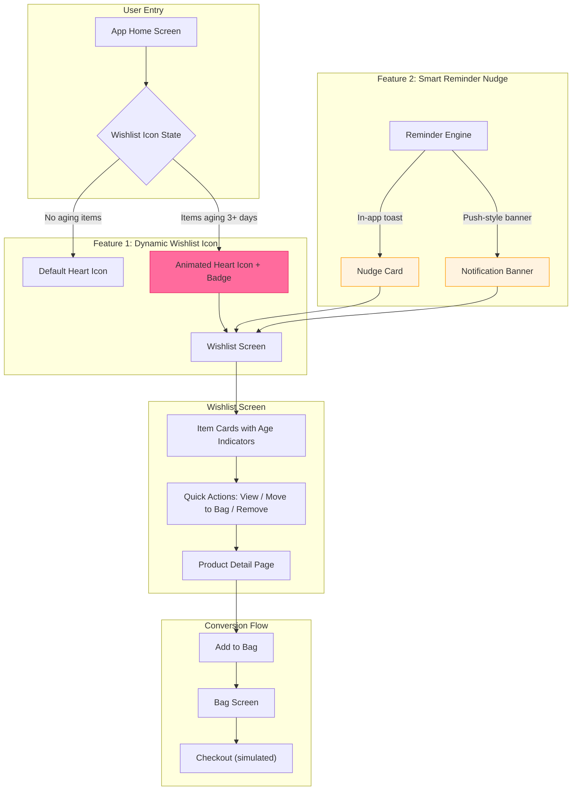
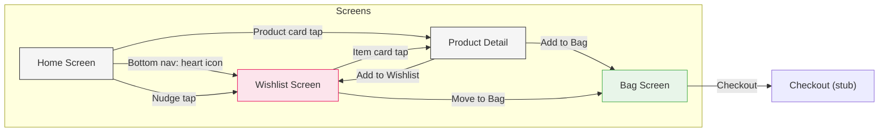
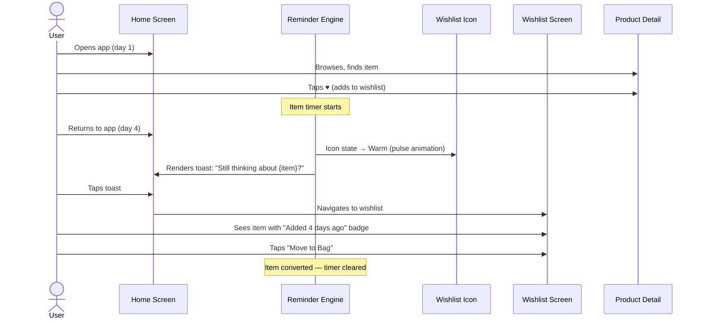
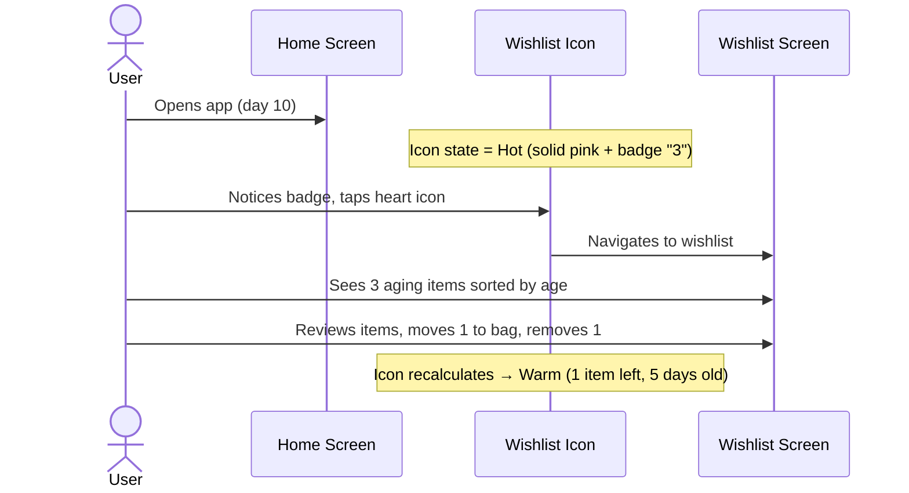

# MVP Architecture: The Forgetful Wishlister

> Based on [problemstatement.md](file:///c:/Users/tanis/projects/Myntra%20MVP/docs/problemstatement.md)

---

## 1. Architecture Overview

This MVP is a **web-based interactive prototype** that simulates the Myntra mobile app experience, demonstrating two core interventions that target the **Revisit** stage of the wishlist → purchase funnel.



---

## 2. Core Features

### Feature 1: Smart Reminder Engine

The engine monitors wishlist item age and triggers contextual nudges to pull the user back to their saved items.

#### Trigger Rules

| Trigger | Timing | Format | Content |
|---|---|---|---|
| **First Nudge** | 3 days after wishlist add | In-app toast | "Still thinking about {item}? It's waiting in your wishlist" |
| **Second Nudge** | 7 days after wishlist add | Persistent banner at top of home | "{item} has been in your wishlist for a week — still interested?" |
| **Urgency Nudge** | 14 days after wishlist add | In-app modal card | "You saved {item} 2 weeks ago. {X} people are viewing it right now" |
| **Last Chance** | 30 days after wishlist add | Full-width home banner | "Your wishlist has items from over a month ago — time for a revisit?" |

#### Nudge Suppression Rules

* **Max 1 nudge per session** — no stacking
* **Suppress after interaction** — if the user taps the nudge (even to dismiss), don't re-trigger the same tier
* **Suppress after wishlist visit** — if the user visits the wishlist organically, reset the nudge timer for all items viewed
* **Prioritize oldest item** — if multiple items are aging, nudge for the oldest unseen item first

#### Nudge Data Model

```
WishlistNudge {
    itemId:          string
    nudgeTier:       "first" | "second" | "urgency" | "lastChance"
    triggeredAt:     timestamp
    interactedAt:    timestamp | null
    dismissed:       boolean
    suppressedUntil: timestamp | null
}
```

---

### Feature 2: Dynamic Wishlist Icon

The heart/wishlist icon in the bottom nav changes appearance based on the state of the user's wishlist, creating **ambient visual salience** without requiring the user to remember to check.

#### Icon States

| State | Condition | Visual Treatment |
|---|---|---|
| **Default** | Wishlist empty or all items < 3 days old | Standard outlined heart, matches notification/profile icons |
| **Warm** | At least 1 item is 3–7 days old | Heart fills with a soft pink pulse animation (subtle, 2s cycle) |
| **Hot** | At least 1 item is 7–14 days old | Heart fills solid pink/red + numeric badge showing count of aging items |
| **Urgent** | At least 1 item is 14+ days old | Heart pulses with a glow effect + badge + color shifts to deeper red |

#### Icon Interaction

* **Tap** → navigates to wishlist screen (standard behavior, unchanged)
* **Long-press** → shows a quick-peek tooltip: "{N} items saved, oldest from {X days ago}"

```mermaid
stateDiagram-v2
    [*] --> Default: Wishlist empty / all items fresh
    Default --> Warm: Item ages past 3 days
    Warm --> Hot: Item ages past 7 days
    Hot --> Urgent: Item ages past 14 days
    Urgent --> Hot: User revisits item (resets that item)
    Hot --> Warm: All aging items revisited
    Warm --> Default: All items fresh or removed
    Urgent --> Default: Wishlist cleared
```

---

## 3. Data Model

### Core Entities

```
User {
    id:              string
    name:            string
    avatar:          string (URL)
    lastActiveAt:    timestamp
}

WishlistItem {
    id:              string
    userId:          string
    productId:       string
    addedAt:         timestamp
    lastViewedAt:    timestamp | null
    movedToBagAt:    timestamp | null
    removedAt:       timestamp | null
    status:          "active" | "in_bag" | "purchased" | "removed"
}

Product {
    id:              string
    name:            string
    brand:           string
    price:           number
    originalPrice:   number | null
    image:           string (URL)
    category:        string
    rating:          number
    reviewCount:     number
    viewerCount:     number (simulated for social proof)
}
```

### Derived State (computed, not stored)

```
ItemAge         = now - WishlistItem.addedAt
DaysSinceViewed = now - WishlistItem.lastViewedAt
IconState       = f(max(ItemAge) across active wishlist items)
NextNudgeTier   = f(ItemAge, previous nudge interactions)
```

---

## 4. Screen Architecture



### Screen Details

#### 1. Home Screen
* **Top bar:** Myntra logo, search bar, notification icon
* **Content:** Product grid (browsable catalog, simulated)
* **Bottom nav:** Home | Categories | Studio | Profile | **♥ Wishlist (dynamic)**
* **Overlay layer:** Nudge toasts, banners, and modal cards rendered here

#### 2. Wishlist Screen
* **Header:** "My Wishlist" + item count + sort/filter controls
* **Item cards** show:
  - Product image, name, brand, price
  - **Age badge:** "Added 3 days ago" / "Added 2 weeks ago" (color-coded by tier)
  - **Quick actions:** "Move to Bag" button, remove (x) icon
* **Empty state:** Illustrated prompt to browse and save items
* **Sorting:** Default sort by `addedAt` descending (newest first), with option to sort by "Oldest first" to surface forgotten items

#### 3. Product Detail Page
* Product hero image
* Name, brand, price, rating
* Size selector (simulated)
* "Add to Bag" primary CTA
* "♥ Wishlist" secondary CTA (toggles)
* Social proof: "{X} people viewing this right now"

#### 4. Bag Screen
* List of items added to bag
* Price summary
* "Place Order" button (simulated — shows success toast)

---

## 5. Technology Stack

| Layer | Choice | Rationale |
|---|---|---|
| **Build tool** | Vite | Fast dev server, zero-config, ideal for prototypes |
| **Framework** | Vanilla JS + Web Components | Lightweight, no framework overhead for a prototype |
| **Styling** | Vanilla CSS with CSS custom properties | Full control over animations, transitions, icon states |
| **State management** | LocalStorage + in-memory store | Simulates persistence without a backend; items survive page refresh |
| **Notifications** | In-app only (DOM-based) | Push notifications require backend infra — out of scope for MVP prototype |
| **Time simulation** | Accelerated clock | A control panel lets reviewers fast-forward time to see nudges and icon state changes without waiting days |

---

## 6. File Structure

```
Myntra MVP/
├── docs/
│   ├── problemstatement.md
│   ├── problemstatement.txt
│   └── architecture.md          ← this document
├── index.html                   ← app shell, meta tags, font imports
├── style.css                    ← global design system (tokens, resets, typography)
├── src/
│   ├── app.js                   ← app initialization, routing, screen mounting
│   ├── store.js                 ← in-memory state + localStorage sync
│   ├── router.js                ← hash-based SPA routing
│   ├── data/
│   │   └── products.json        ← seed catalog (10–15 products)
│   ├── components/
│   │   ├── bottom-nav.js        ← bottom navigation bar with dynamic heart icon
│   │   ├── wishlist-icon.js     ← the dynamic heart icon component (Feature 2)
│   │   ├── nudge-toast.js       ← in-app toast notification
│   │   ├── nudge-banner.js      ← persistent home banner
│   │   ├── nudge-modal.js       ← urgency modal card
│   │   ├── product-card.js      ← product grid card (home screen)
│   │   ├── wishlist-card.js     ← wishlist item card with age badge
│   │   └── time-control.js      ← dev panel: fast-forward simulated time
│   ├── screens/
│   │   ├── home.js              ← home screen with product grid + nudge layer
│   │   ├── wishlist.js          ← wishlist screen with sorted item list
│   │   ├── product-detail.js    ← PDP with add-to-bag / add-to-wishlist
│   │   └── bag.js               ← bag screen with checkout stub
│   └── engine/
│       ├── reminder-engine.js   ← nudge scheduling, suppression, tier logic (Feature 1)
│       └── icon-state.js        ← computes icon state from wishlist ages (Feature 2)
├── assets/
│   └── icons/                   ← heart icon SVGs for each state
├── package.json
└── vite.config.js
```

---

## 7. Key User Flows

### Flow 1: Passive Re-engagement (Core MVP Flow)



### Flow 2: Icon-Driven Organic Revisit



---

## 8. Time Simulation Panel

Since the prototype can't wait real days for nudges to trigger, a **developer/reviewer control panel** is included:

* **Floating button** (bottom-left, labeled ⏩) opens a slide-out panel
* Controls:
  - "Advance time by: 1 day / 3 days / 7 days / 14 days / 30 days"
  - "Current simulated date: {date}"
  - "Reset to real time"
* **Effect:** Advancing time triggers the reminder engine to re-evaluate all items and update icon state + pending nudges immediately
* **Hidden by default** in "presentation mode" — toggled via a keyboard shortcut (e.g., `Ctrl+Shift+T`)

---

## 9. Design Tokens

```css
/* Color palette — Myntra-inspired */
--color-primary:        #ff3f6c;   /* Myntra pink */
--color-primary-light:  #ff6b9d;
--color-primary-dark:   #d81b60;
--color-surface:        #ffffff;
--color-surface-alt:    #f5f5f6;
--color-text-primary:   #282c3f;
--color-text-secondary: #94969f;
--color-success:        #03a685;
--color-warning:        #ff9800;
--color-urgent:         #e53935;

/* Icon state colors */
--icon-default:         #94969f;
--icon-warm:            #ff6b9d;
--icon-hot:             #ff3f6c;
--icon-urgent:          #d32f2f;

/* Timing */
--transition-fast:      150ms ease;
--transition-medium:    300ms ease;
--transition-slow:      600ms ease;
--pulse-duration:       2s;

/* Spacing scale */
--space-xs:             4px;
--space-sm:             8px;
--space-md:             16px;
--space-lg:             24px;
--space-xl:             32px;

/* Typography */
--font-family:          'Inter', -apple-system, sans-serif;
--font-size-xs:         11px;
--font-size-sm:         13px;
--font-size-base:       14px;
--font-size-md:         16px;
--font-size-lg:         20px;
--font-size-xl:         24px;
```

---

## 10. Success Criteria for the Prototype

| Criterion | How It's Demonstrated |
|---|---|
| **Nudge triggers at correct intervals** | Use time simulation to advance through 3, 7, 14, 30-day tiers and verify each nudge type appears |
| **Icon state changes visually** | Heart icon visibly transitions through Default → Warm → Hot → Urgent as items age |
| **Nudge suppression works** | After tapping a nudge, the same tier does not re-trigger; after visiting wishlist, timers reset |
| **Items can be revisited and converted** | Full flow from wishlist → product detail → add to bag → checkout stub |
| **No discounting involved** | Zero price manipulation anywhere — pure recall mechanism |
| **Metric is trackable** | Console logs or a stats panel showing: items wishlisted, items revisited, items moved to bag, simulated "conversion rate" |
